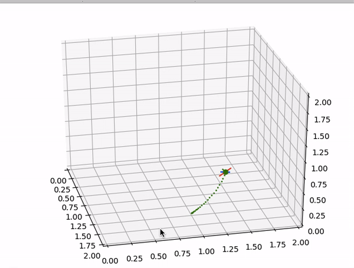

## Quadrotor simulation

### This project contains:
- Informed RRT* to plan a collision free path from start to goal position in an N-dimensional Map.
- A minimum snap trajectory generator. The segment times between consecutive waypoints are also optimised.
- Nonlinear geometric controller for aggressive trajectory tracking and hover controller
- Quadrotor Simulator

### Dependencies
- scipy
- numpy
- matplotlib
- rtree-linux

### Usage

#### Trajectory generation and control example
```python
from TrajGen import trajGenerator, Helix_waypoints
from Quadrotor import QuadSim
import controller

waypoints = Helix_waypoints(5)

#Generate trajectory through waypoints
traj = trajGenerator(waypoints,max_vel = 10,gamma = 1000000)

#initialise simulation with given controller and trajectory
Tmax = traj.TS[-1]
des_state = traj.get_des_state
sim = QuadSim(controller,des_state,Tmax)

#run simulation
sim.run()
```


#### With Path Planning
```python
python3 runsim.py
```
#### Output


### Future Work

- Adding disturbance to quadrotor model
- Collision checking after trajectory generation

### References
- [Polynomial Trajectory Planning for Aggressive Quadrotor Flight in Dense Indoor Environments - Charles Richter, Adam Bry, and Nicholas Roy](https://groups.csail.mit.edu/rrg/papers/Richter_ISRR13.pdf)
- [Trajectory Generation and Control for Quadrotors - Daniel Mellinger and Vijay Kumar](https://repository.upenn.edu/cgi/viewcontent.cgi?article=1705&context=edissertations)
- [Motion Planning as Search - Russ Tedrake](http://underactuated.csail.mit.edu/planning.html#section2)
